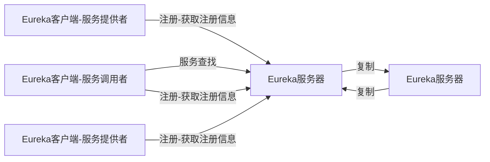

Spring Cloud集成了Netflix OSS的多个项目，形成了spring-cloud-netflix项目。该项目包含多个子模块，这些子模块对集成的Netflix旗下的框架进行了封装，本文讲述其中一个重要的服务管理框架：Eureka。
<!--more-->

## 1. Eureka介绍

### 关于Eureka

Eureka提供基于REST的服务，在集群中主要用于服务管理。

### Eureka脚骨

一个简单的Eureka集群，需要一个Eureka服务器、若干个服务提供者。我们可以将业务组件注册到Eureka服务器中，其他客户端组件可以向服务器获取服务并且进行远程调用。以下是Eureka架构图：

如上图，有两个服务器，服务器支持集群部署，每个服务器也可以作为对方服务器的客户端进行相互注册和复制。有三个Eureka客户端，两个用于发布服务，另一个用于调用服务。

### 服务器端

### 服务提供者

### 服务调用者